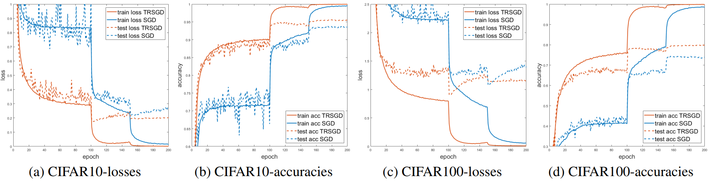
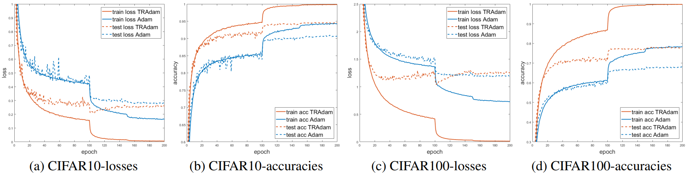
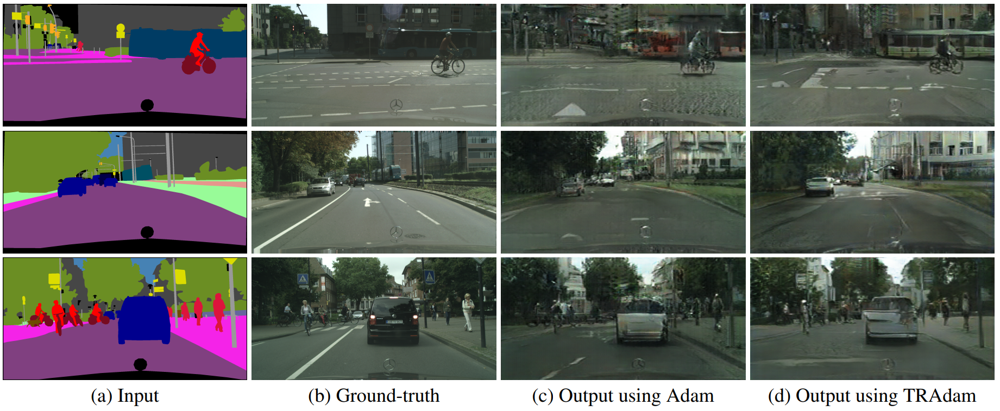

# Trajectory Regularized Algorithm (TRSGD, TRAdam)
## Description

This repository contains the PyTorch code for the paper
> Yikai Zhang\*,  Hui Qu\*, Dimitris Metaxas and Chao Chen. *Taming the Noisy Gradient: Train Deep Neural Networks with Small Batch Sizes*. IJCAI, 2019. (* equal contributions)

The trajectory regularized algorithm iteratively applies a proximal type regularizer to make loss function strongly convex, thus stablizes the gradient when the batch size is small,
leading to better training performance.


## Train with TRAlgorithm
Before training, set the options and data transforms in ```options.py```. Most options are set as default values,
and a part of them can be also parsed from the command line, for example:
```train
python train.py --dataset cifar10 --optimizer trsgd --model ResNet18 --save-dir ./experiments/cifar10/trsgd --lr 0.1 --batch-size 8 --epochs 200
```

## Applications

### Image Classification on CIFAR10 and CIFAR100

TRSGD


TRAdam


### Label &rarr; Photo Synthesis using GAN on Cityscapes dataset



## Citation
If you find this code helpful, please cite our work:

```
@inproceedings{TRAlgorithm,
  title={Taming the Noisy Gradient: Train Deep Neural Networks with Small Batch Sizes},
  author={Zhang, Yikai and Qu, Hui and Metaxas, Dimitris and Chen, Chao},
  booktitle={International Joint Conference on Artificial Intelligence (IJCAI)},
  year={2019}
}
```